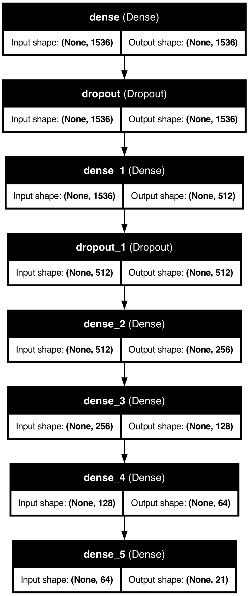

# Classify by Neural Network 
Designed a Neural network to categorize each bible verses to 21 topics.

## neural network classifier 
Configuration of original neural netowrk model 
| Layer (type)        | Output Shape | Param # |
|---------------------|-------------|---------|
| **dense_4 (Dense)** | (None, 1536)  | 2360832  |
| **dropout (Dropout)** | (None, 1536) | 0 |
| **dense_5 (Dense)** | (None, 128) | 16,512 |
| **dropout_1 (Dropout)** | (None, 128) | 0 |
| **dense_6 (Dense)** | (None, 64) | 8,256 |
| **dense_7 (Dense)** | (None, 21) | 1,365 |

### Overfitting by 1536-D input
from the following two figure, use all dimention as input feature, make the model overfitting. 

considering reduce the dimention of embedding. Got some improvement (reduced dimention to 16)

created another AutoEncoder Neural network model to reduce dimention. model details are following
| Layer (type)        | Output Shape | Param # |
|---------------------|-------------|---------|
| input_layer(inputLayer)| (None, 1536)  | 0  |
| **dense (Dense)** | (None, 16) | 24,592 |
| **dense_1 (Dense)** | (None, 16) | 272 |
| **dense_2 (Dense)** | (None, 3072) | 52,224 |
| **dense_3 (Dense)** | (None, 1536) | 4,720,128 |

# Other two dimention reduction agrithem 
## Reduced dimention by PCA model

## Reduced dimention by UMAP model
